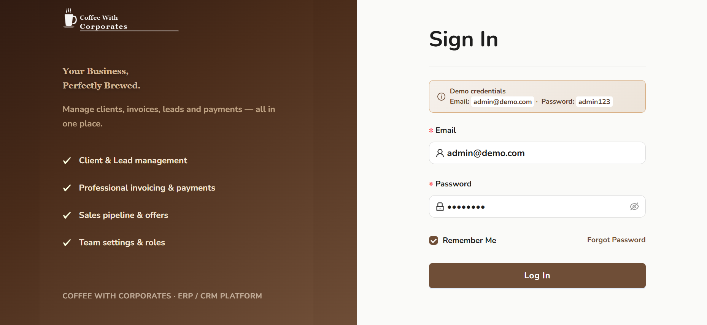
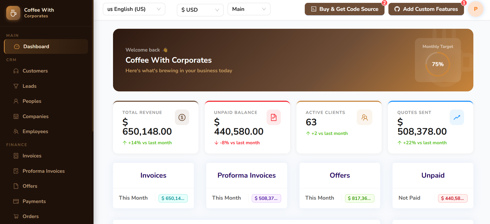
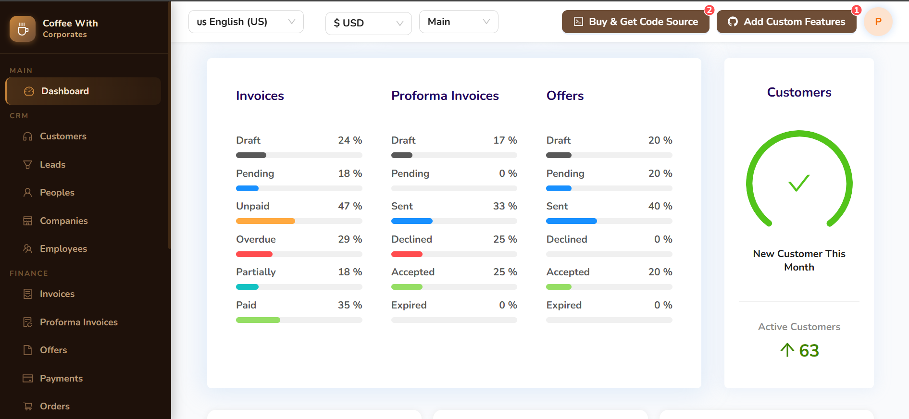
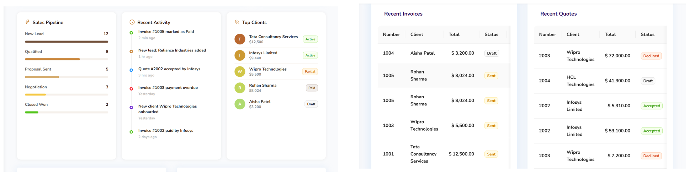
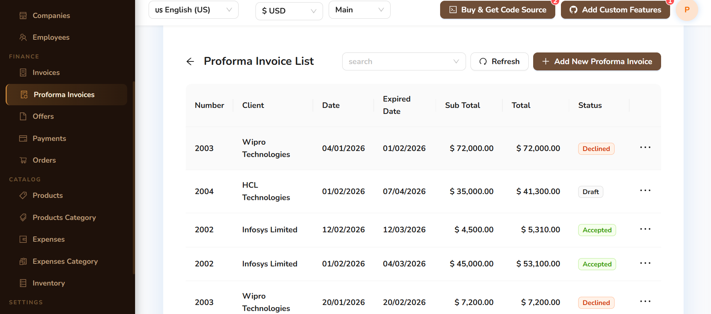
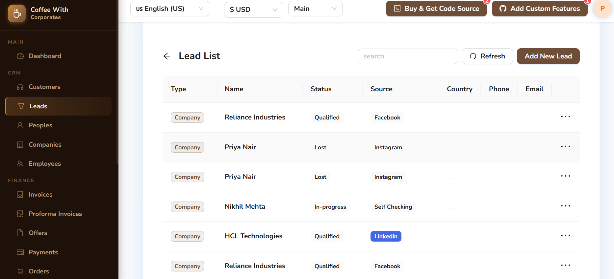
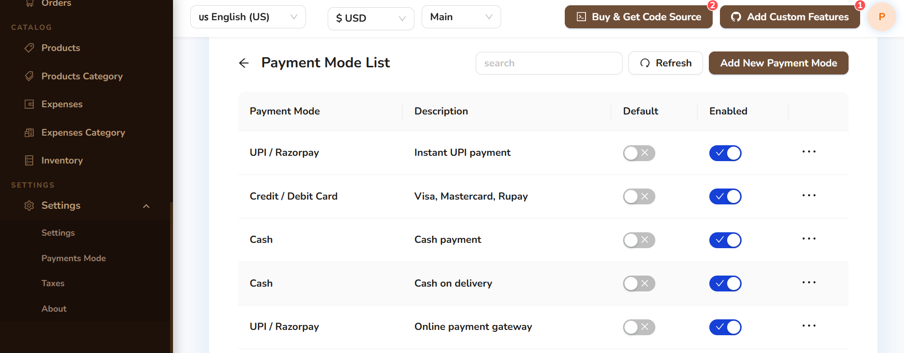
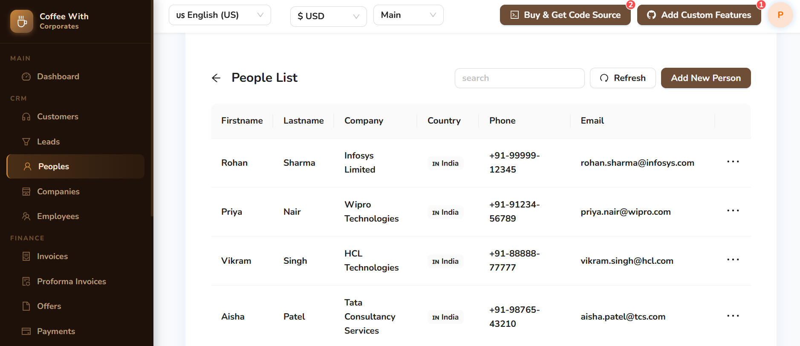
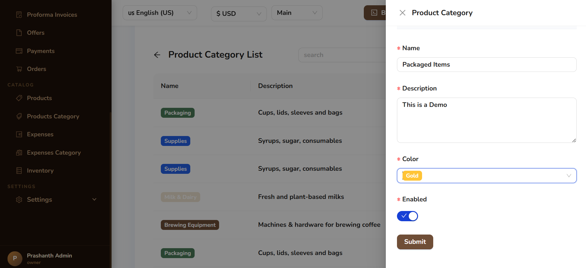

<div align="center">

# ☕ Coffee With Corporates

### *Your Business, Perfectly Brewed.*

**A full-featured ERP & CRM platform for modern businesses — manage clients, invoices, leads and payments all in one place.**

[](https://nodejs.org)
[](https://react.dev)
[](https://mongodb.com)
[](https://ant.design)
[](https://expressjs.com)

**[🚀 Quick Start](#-quick-start) · [✨ Features](#-features) · [🏗 Architecture](#-architecture) · [📖 API Reference](#-api-reference) · [🔧 Configuration](#-configuration)**

---

</div>

## 🖥️ App Screenshots

### 🔐 Login — *Your Business Starts Here*

> Clean two-panel login with pre-filled demo credentials for instant access.



---

### 📊 Dashboard — *Your Business at a Glance*

> Revenue KPIs, Monthly Target tracker, and summary cards for Invoices, Proforma Invoices, Offers, and Unpaid balances.



---

### 📈 Dashboard — *Status Breakdowns*

> Visual progress bars showing Invoice, Proforma Invoice, and Offer statuses — plus a live New Customer gauge.



---

### 🔥 Dashboard — *Pipeline, Activity & Top Clients*

> Sales Pipeline stages, Recent Activity feed, Top Clients list, Recent Invoices, and Recent Quotes — all at once.



---

### 🧾 Proforma Invoices — *Quotes That Convert*

> Full list of proforma invoices with client, date, expiry, subtotal, total, and status badges (Accepted / Declined / Draft).



---

### 💬 Leads — *Your Sales Pipeline*

> Track leads by type, name, current status, and acquisition source (Facebook, LinkedIn, Instagram, Self Checking).



---

### 💳 Payment Modes — *Flexible Payment Configuration*

> Configure and enable payment methods like UPI/Razorpay, Credit/Debit Card, Cash, and Cash on Delivery with default toggles.



---

### 👥 People — *Your Contact Directory*

> Full contact directory with first name, last name, linked company, country flag, phone, and email — all in one clean view.



---

### 🏷️ Product Categories — *Organised Catalog Taxonomy*

> Color-coded category badges (Packaging, Supplies, Milk & Dairy, Brewing Equipment) with slide-in edit panel.



---

## ✨ Features

### 💰 Finance & Billing
- **Invoices** — GST-compliant invoices with automatic tax calculation, PDF download, email send
- **Quotes / Proforma Invoices** — Convert approved quotes to invoices in one click
- **Offers** — Send offers to leads and track acceptance
- **Payments** — Record payments with multiple modes (Bank, UPI, Cash, Card, Cheque)
- **Expenses** — Categorised expense tracking with receipts
- **Tax Management** — Multiple tax rates (GST 0%, 5%, 12%, 18%, 28%)
- **Multi-Currency** — INR, USD, EUR, GBP, AED and 50+ more

### 🤝 CRM
- **Clients** — Company + individual client database
- **People** — Contact directory linked to companies
- **Companies** — B2B company management with linked contacts
- **Leads** — Full pipeline management with source tracking
- **Orders** — Track customer orders end-to-end with status workflow

### 📦 Inventory & Products
- **Products** — Catalog with category, pricing, currency
- **Product Categories** — Organised product taxonomy with color coding
- **Inventory** — Real-time stock levels, SKUs, locations, reorder alerts

### 👔 HR
- **Employees** — Full HR directory with departments, positions, bank details, social media

### ⚙️ System
- JWT authentication with role-based access (Owner / Admin / Staff)
- Multi-language UI (English, हिन्दी, తెలుగు, Français, Deutsch, Español + 12 more)
- Responsive mobile-first design
- Company branding & logo upload
- Email notifications via Resend
- S3-compatible file uploads

---

## 🚀 Quick Start

### Prerequisites
- Node.js ≥ 20.0.0
- MongoDB ≥ 5.0 (local or Atlas)
- npm ≥ 9

### 1. Clone & Install

```bash
git clone https://github.com/your-org/coffee-with-corporates.git
cd coffee-with-corporates

# Backend
cd backend && npm install

# Frontend
cd ../frontend && npm install
```

### 2. Configure Environment

Create `backend/.env`:

```env
# Required
DATABASE=mongodb://localhost:27017/coffee_with_corporates
JWT_SECRET=your-super-secret-jwt-key-change-this-in-production

# Optional - Email (Resend)
RESEND_API=re_your_resend_api_key

# Optional - File Uploads (AWS S3 / compatible)
S3_ACCESS_KEY_ID=your_access_key
S3_SECRET_ACCESS_KEY=your_secret_key
S3_REGION=ap-south-1
S3_BUCKET=your-bucket-name

# Server
PORT=8888
NODE_ENV=development
PUBLIC_SERVER_FILE=http://localhost:8888/
```

Create `frontend/.env`:

```env
VITE_BACKEND_SERVER=http://localhost:8888/
```

### 3. Seed Demo Data

```bash
cd backend
node src/setup/setup.js
```

This creates:
- ✅ Admin account: `admin@demo.com` / `admin123`
- ✅ 5 Tax rates (GST 0%, 5%, 12%, 18%, 28%)
- ✅ 5 Payment modes (Bank, Cash, UPI, Card, Cheque)
- ✅ 5 Product categories + 13 products
- ✅ 6 Expense categories + 10 expenses
- ✅ 5 Companies + 6 People contacts
- ✅ 7 Clients (corporate & individual)
- ✅ 7 Leads with pipeline stages
- ✅ 7 Invoices (various statuses & GST rates)
- ✅ 5 Quotes (draft, sent, accepted, declined)
- ✅ 5 Offers linked to leads
- ✅ 4 Payments recorded
- ✅ 8 Employees with departments
- ✅ 13 Inventory items with SKUs
- ✅ 7 Orders with status tracking

### 4. Run

```bash
# Terminal 1 – Backend
cd backend && npm start
# → Listening on http://localhost:8888

# Terminal 2 – Frontend
cd frontend && npm run dev
# → Open http://localhost:3000
```

### 5. Login

Open **http://localhost:3000** and use the demo credentials:

| Field | Value |
|-------|-------|
| Email | `admin@demo.com` |
| Password | `admin123` |

---

## 🏗 Architecture

```
coffee-with-corporates/
├── backend/                     # Node.js + Express API
│   └── src/
│       ├── app.js               # Express app setup
│       ├── server.js            # HTTP server entry point
│       ├── models/
│       │   ├── coreModels/      # Admin, Setting, AdminPassword
│       │   └── appModels/       # Invoice, Client, Product, etc. (19 models)
│       ├── controllers/
│       │   ├── appControllers/  # Business logic per entity
│       │   ├── coreControllers/ # Auth, Settings, Email
│       │   └── pdfController/   # PDF generation (PDFKit)
│       ├── routes/
│       │   ├── coreRoutes/      # Auth, Settings, Download
│       │   └── appRoutes/       # Auto-generated CRUD routes
│       ├── middlewares/         # Auth, Settings loader, File upload
│       ├── setup/               # Database seeder
│       ├── locale/              # Backend translations
│       └── pdf/                 # Pug templates (invoice, quote, offer)
│
└── frontend/                    # React 18 + Vite SPA
    └── src/
        ├── App.jsx
        ├── apps/
        │   ├── Navigation/      # Sidebar navigation
        │   └── Header/          # Top bar with currency selector
        ├── pages/               # One folder per entity page
        ├── modules/             # CrudModule, ErpPanelModule, Dashboard
        ├── forms/               # Ant Design form components
        ├── redux/               # Redux Toolkit slices
        ├── locale/              # 18+ language translations
        ├── settings/            # useMoney, useDate hooks
        └── request/             # Axios API client
```

### Data Flow

```
Browser → React → Redux → Axios → Express → MongoDB
                ↑                    ↓
           Redux Store          Mongoose Models
```

### Auto-Generated Routes

All 19 app models automatically get these REST endpoints:

```
POST   /api/{entity}/create
GET    /api/{entity}/read/:id
PATCH  /api/{entity}/update/:id
DELETE /api/{entity}/delete/:id
GET    /api/{entity}/list
GET    /api/{entity}/listAll
GET    /api/{entity}/search
GET    /api/{entity}/filter
GET    /api/{entity}/summary
```

---

## 📖 API Reference

### Authentication

```http
POST /api/login
Content-Type: application/json

{ "email": "admin@demo.com", "password": "admin123" }
```

Response sets an HTTP-only JWT cookie.

### Core Entities

| Entity | Route Base | Notes |
|--------|-----------|-------|
| Invoice | `/api/invoice` | + `/mail`, PDF download |
| Quote | `/api/quote` | + `/mail`, `/convert/:id` |
| Offer | `/api/offer` | + `/mail` |
| Payment | `/api/payment` | |
| Client | `/api/client` | |
| Lead | `/api/lead` | |
| People | `/api/people` | |
| Company | `/api/company` | |
| Product | `/api/product` | |
| ProductCategory | `/api/productcategory` | |
| Expense | `/api/expense` | |
| ExpenseCategory | `/api/expensecategory` | |
| Taxes | `/api/taxes` | |
| PaymentMode | `/api/paymentmode` | |
| Employee | `/api/employee` | |
| Inventory | `/api/inventory` | |
| Order | `/api/order` | |
| Setting | `/api/setting` | Core route |

### PDF Download

```
GET /download/{entity}/{entity}-{id}.pdf
```

Example: `GET /download/invoice/invoice-6507abc123.pdf`

---

## 🔧 Configuration

### Environment Variables

| Variable | Required | Default | Description |
|----------|----------|---------|-------------|
| `DATABASE` | ✅ | — | MongoDB connection URI |
| `JWT_SECRET` | ✅ | — | JWT signing secret |
| `PORT` | ❌ | `8888` | Backend port |
| `NODE_ENV` | ❌ | `development` | `development` or `production` |
| `RESEND_API` | ❌ | — | Resend API key for email |
| `S3_ACCESS_KEY_ID` | ❌ | — | AWS S3 access key |
| `S3_SECRET_ACCESS_KEY` | ❌ | — | AWS S3 secret |
| `S3_REGION` | ❌ | `ap-south-1` | S3 bucket region |
| `S3_BUCKET` | ❌ | — | S3 bucket name |
| `PUBLIC_SERVER_FILE` | ❌ | `http://localhost:8888/` | Public URL for file access |

### Frontend Environment

| Variable | Required | Default |
|----------|----------|---------|
| `VITE_BACKEND_SERVER` | ✅ | `http://localhost:8888/` |

---

## 🐛 Known Fixes Applied

This repository includes fixes for 15+ bugs from the original codebase:

| Bug | Fix |
|-----|-----|
| `GET /api/currency/listAll` → 404 | Removed API dependency; currency picker uses local static list |
| `paymentMode` entity 404 | Fixed to lowercase `paymentmode` to match auto-generated routes |
| PDF download failing (PhantomJS) | Replaced `html-pdf` with `PDFKit` (pure Node.js, no binary deps) |
| Login no pre-fill | Added `initialValue` to form fields + demo credentials banner |
| Employee, Inventory, Order pages missing | Added routes, navigation entries, and full page configs |
| `isDate()` in helpers → ReferenceError | Added missing `dayjs` import |
| `/category/expenses` route typo | Fixed leading slash |
| Inventory model missing | Created with all fields matching the form |
| Order model ref typo `'Ivoince'` | Fixed to `'Invoice'` |
| Language translation broken | Fixed translation action to bundle correctly |

---

## 📁 Pages Overview

| Page | Route | Description |
|------|-------|-------------|
| Dashboard | `/` | KPIs, pipeline, recent invoices |
| Invoices | `/invoice` | Invoice list, create, PDF |
| Quotes | `/quote` | Proforma invoice management |
| Offers | `/offer` | Lead-linked offers |
| Payments | `/payment` | Payment recording & history |
| Clients | `/customer` | Client list & profiles |
| Leads | `/lead` | Lead pipeline |
| People | `/people` | Contact directory |
| Companies | `/company` | B2B company database |
| Employees | `/employee` | HR directory |
| Products | `/product` | Product catalog |
| Product Categories | `/category/product` | Product taxonomy |
| Inventory | `/inventory` | Stock management |
| Orders | `/order` | Order tracking |
| Expenses | `/expense` | Expense tracking |
| Expense Categories | `/category/expenses` | Expense taxonomy |
| Taxes | `/taxes` | Tax rate management |
| Payment Modes | `/payment/mode` | Payment method config |
| Settings | `/settings` | App configuration |

---

## 🤝 Contributing

1. Fork the repository
2. Create your feature branch: `git checkout -b feature/amazing-feature`
3. Commit your changes: `git commit -m 'Add amazing feature'`
4. Push to the branch: `git push origin feature/amazing-feature`
5. Open a Pull Request

---

## 📄 License

This project is built by Prashanth, customised for Coffee With Corporates.

---

<div align="center">

**Built with ❤️ and ☕ for Coffee With Corporates**

[⬆ Back to top](#-coffee-with-corporates)

</div>